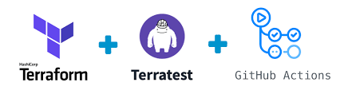
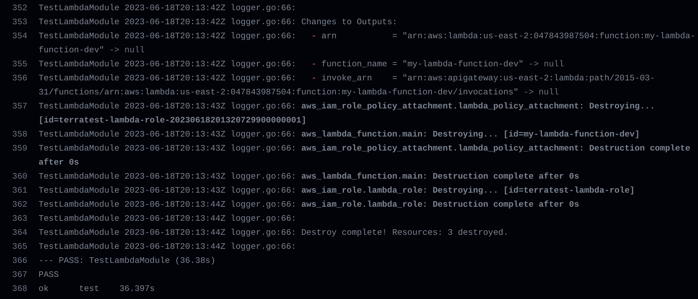
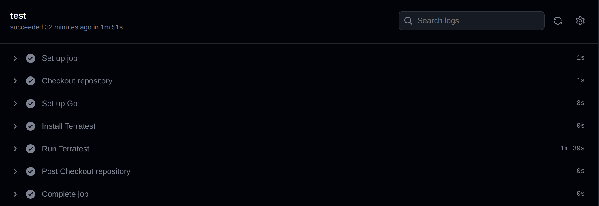

<p align="center">
  
</p>


# Terratest Lambda Sample

This repository provides a sample project for testing AWS Lambda functions using Terratest.

## Overview

The project demonstrates how to write automated tests for AWS Lambda functions using Terratest, a Go library for testing infrastructure code. It includes an example Lambda function and corresponding test code.

## Prerequisites

Before running the tests, ensure you have the following prerequisites:

- Go programming language (version 1.16 or later) installed on your system.
- AWS account credentials configured locally, either through environment variables or the AWS CLI.

## Getting Started

To get started, follow these steps:

1. Clone the repository:

   ```shell
   git clone https://github.com/roger-amorim-dv/terratest-lambda-sample.git
   ```

2. Change into the project directory:

   ```shell
   cd terratest-lambda-sample/test
   ```

3. Build and run the tests:

   ```shell
   go mod init
   go mod tidy
   go test -v
   ```

   This command will build the project and run all the tests.


## GitHub Actions Workflow

This repository includes a GitHub Actions workflow that automatically runs the tests whenever changes are made to the code. The workflow configuration can be found in the [.github/workflows/terratest.yml](.github/workflows/terratest.yml) file.

The workflow is triggered on pull requests that modify files under the `terraform/modules` directory. It sets up the Go environment, installs Terratest, and runs the tests using the `go test` command.

Look this successfully lambda tests example:



Look this successfully pipeline example:



## Resources

- [Terratest Documentation](https://terratest.gruntwork.io/docs/)
- [AWS Lambda Developer Guide](https://docs.aws.amazon.com/lambda/latest/dg/welcome.html)